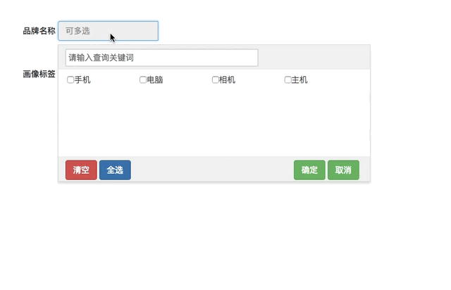
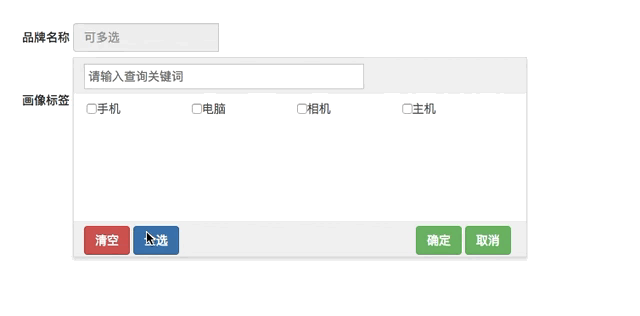
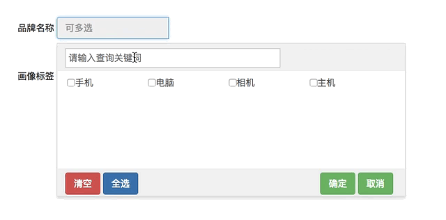

## 多选菜单组件

### 功能

- 搜索
- 多选
- 全选
- 清空

### 功能演示





### 使用说明


1. input的配置

```
<input type="text" readonly="true" placeholder="可多选" class="rp-select-input form-control" id="category">
```

input 标签必须加上唯一的id

2. js代码配置：想使用selectMenu组件，需要调用selectMenu方法（只需调用一次）

```
var options = {
  category: [{
    title: '手机',
    id: '1'
  },
  {
    title: '电脑',
    id: '2'
  },
  {
    title: '相机',
    id: '3'
  }]
}
  $.fn.selectMenu(options)
```

* 注意：options对象中的属性名与input的id保持一致，category对应的属性值（数组）就是该名称input对应的所有选项内容，并且在调用selectMenu方法的时候就必须指定所有的input的id

3. 修改某一input对应的选项内容: 调用selectMenu的changeOption方法

```
$.fn.selectMenu.changeOption('category', [{
    title: '手机',
    id: '1'
  },
  {
    title: '电脑',
    id: '2'
  },
  {
    title: '相机',
    id: '3'
  },
  {
    title: '主机',
    id: '4'
  }
])
```

4. 获取input框对应的选项值集合

对于以下input

```
<input type="text" readonly="true" placeholder="可多选" class="rp-select-input form-control" id="category">
```

可以通过`$('#category').val()`来获取所有选项的文本内容集合

可以通过`$.fn.selectMenu.getSelectValue('category')`来获取所有选项的值集合